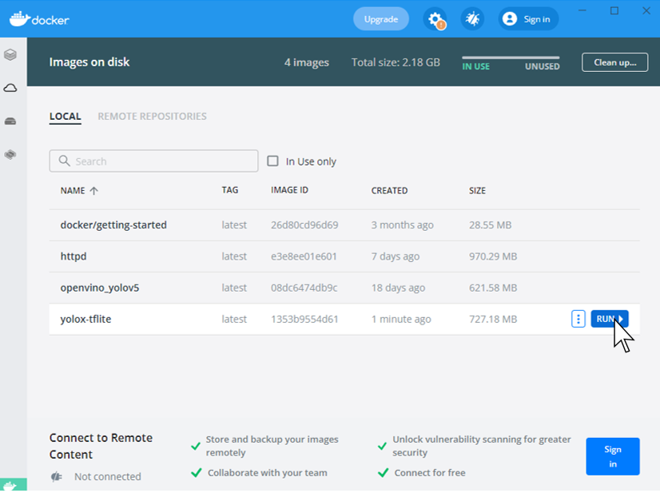

# yolox-tensorflow-lite

研究室内用の Docker セミナー用リポジトリ

1. Docker Desktop をインストールする.  
    
   **<Windows の場合>**  
    Windows 用の公式インストーラは ↓ こちら ↓ からインストールする．  
    ["Install Docker Desktop on Windows"](https://docs.docker.com/desktop/windows/install/)    
    検索すれば Docker Desktop のインストール手順を紹介している記事もある．  
    ["Docker インストール手順＜ Windows 向け＞
   "](https://sukkiri.jp/technologies/virtualizers/docker/docker-win_install.html)  
     
   **<Mac の場合>**  
    Mac 用の公式インストーラは ↓ こちら ↓ からインストールする.  
    ["Install Docker Desktop on Mac"](https://docs.docker.com/desktop/mac/install/)  
     
   検索すれば Docker Desktop のインストール手順を紹介している記事もある．  
    ["Mac に docker インストール - Qiita
   "](https://qiita.com/ama_keshi/items/b4c47a4aca5d48f2661c)  
     
2. モデルと入力をダウンロード  
   佐藤が提供する YOLOX のモデルとサンプル用の入力動画を[https://drive.google.com/drive/folders/11Pp_9KuiRunPNnuYZ4t71QwQk3isCDGF?usp=sharing](https://drive.google.com/drive/folders/11Pp_9KuiRunPNnuYZ4t71QwQk3isCDGF?usp=sharing)からダウンロードする. その後，それらファイルを root ディレクトリに配置する．このときのディレクトリ構造は以下の通り.  
    
   
    

3. X server のインストール・起動  
    最終的に物体検出の結果を表示するが，そのためには X server をインストールする必要がある.  
     
   **<Windows の場合>**  
    以下のサイトからダウンロード  
    ["VcXsrv Windows X Server download | SourceForge.net"](https://sourceforge.net/projects/vcxsrv/)  
    起動時には特に特殊な設定をする必要は無く，「次へ」を連打するだけでいい．起動に成功するとツールバーに以下のような表示が出る．
    
   
    

   **<Mac の場合>**  
    Homebrew 経由でのインストールが推奨  
    「Homebrew」って何？って思った人は以下を参照  
    ["Homebrew のインストール - Qiita"](https://qiita.com/zaburo/items/29fe23c1ceb6056109fd)

   "XQuartz"というソフトウェアを利用する．  
    インストール手順は以下のサイトを参照  
    ["Docker 上の GUI 出力を Mac で表示"](https://qiita.com/uedashuhei/items/3f6f8612b5c4a2b00b1a)  
    上記のサイトの中で"ホスト側"の欄だけ行って，XQuartz 起動しておけば良い．  
    

4. Docker によるビルドとプログラムの実行  
   (セミナーでは，ここで Dockerfile を記述する)  
    当ディレクトリまでターミナル上で移動する．そして，以下のコマンドを実行する.  
    `docker build -t yolox-tflite .`  
    Docker のビルドが正常終了すると Docker デスクトップ上に"yolox-tflite"のイメージが追加される  
     
     
    
   GUI 上で"run"を押すか，ターミナル上で  
    `docker run yolox-tflite`  
   を実行する.ことで，物体検出の結果が表示される．

## Q&A

Q. "error during connect: This error may indicate that the docker daemon is not running."が出る…  
A. docker が起動していないので Win10 の場合は Docker Desktop を起動してください．

 
